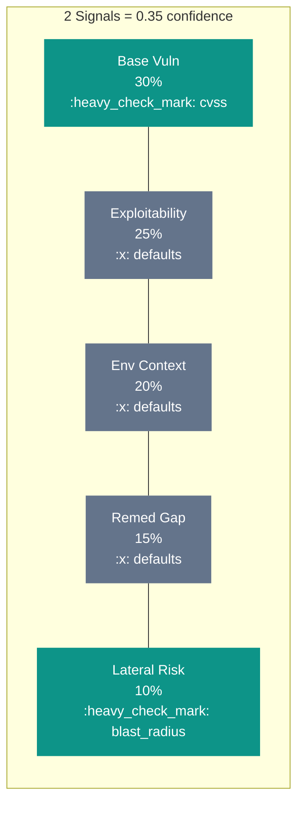
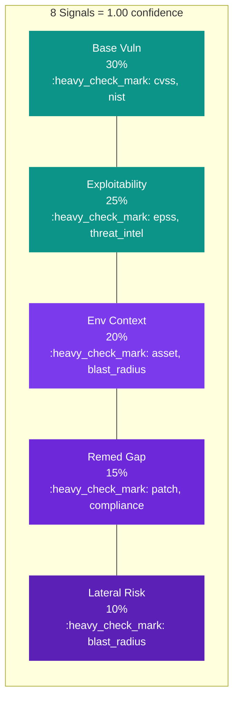

# Confidence

Every ORES result includes a **confidence** value between `0.0` and `1.0`. Confidence tells you how much of the scoring model was backed by real [signals](signals.md) you provided, versus neutral defaults the engine assumed on your behalf.

---

## The Intuition

Think of the ORES scoring model as a **puzzle with five pieces** — the five [scoring dimensions](scoring.md). Each piece has a different size (weight), and each piece can be filled in by one or more signals.

When you provide signals, you fill in pieces of the puzzle with real data. The pieces you leave empty get filled with neutral defaults — reasonable assumptions, but assumptions nonetheless.

**Confidence answers one question:** *How much of the puzzle is real data versus assumptions?*





!!! tip "Confidence is metadata, not a penalty"
    Confidence does **not** reduce or adjust the score. The score already reflects defaults for uncovered dimensions. Confidence is there to tell *you* — and your downstream systems — how trustworthy that score is.

---

## How Confidence Is Calculated

Confidence is a **weighted average of dimension coverage**. For each of the five scoring dimensions, ORES checks how many of the recognized signal types you provided:

| Dimension | Weight | Signal Types | Sources |
|-----------|:------:|-------------|:-------:|
| :material-shield-bug-outline: Base Vulnerability | 30% | `cvss`, `nist` | 2 |
| :material-target: Exploitability | 25% | `epss`, `threat_intel` | 2 |
| :material-server-security: Environmental Context | 20% | `asset`, `blast_radius` | 2 |
| :material-wrench-clock: Remediation Gap | 15% | `patch`, `compliance` | 2 |
| :material-expansion-card: Lateral Risk | 10% | `blast_radius` | 1 |

For each dimension:

```
dimension_coverage = (sources you provided) / (total sources for that dimension)
```

Then confidence is the weighted sum:

```
confidence = SUM(dimension_weight * dimension_coverage)
```

??? example "Worked Example: `cvss` + `epss` + `threat_intel`"
    You provide three signals: `cvss`, `epss`, and `threat_intel`.

    | Dimension | Coverage | Weighted |
    |-----------|----------|----------|
    | Base Vulnerability (30%) | 1/2 = 0.50 | 0.30 x 0.50 = **0.150** |
    | Exploitability (25%) | 2/2 = 1.00 | 0.25 x 1.00 = **0.250** |
    | Environmental Context (20%) | 0/2 = 0.00 | 0.20 x 0.00 = **0.000** |
    | Remediation Gap (15%) | 0/2 = 0.00 | 0.15 x 0.00 = **0.000** |
    | Lateral Risk (10%) | 0/1 = 0.00 | 0.10 x 0.00 = **0.000** |
    | | | **= 0.40** |

    Final confidence: **0.40**

---

## Confidence by Signal Count

Here is how confidence builds as you add signals, assuming you add the highest-impact signals first:

| Signals Provided | Confidence | Level |
|:----------------|:----------:|:-----:|
| `cvss` only | 0.15 | :material-circle-outline: Very Low |
| `cvss` + `nist` | 0.30 | :material-circle-half-full: Low |
| `cvss` + `nist` + `epss` | 0.43 | :material-circle-half-full: Moderate |
| `cvss` + `nist` + `epss` + `threat_intel` | 0.55 | :material-circle-slice-6: Moderate |
| + `asset` | 0.65 | :material-circle-slice-6: Good |
| + `blast_radius` | 0.85 | :material-circle-slice-8: High |
| + `patch` | 0.93 | :material-circle-slice-8: High |
| + `compliance` (all 8) | **1.00** | :material-check-circle: Complete |

---

## Confidence Ranges

| Range | Level | Interpretation |
|:-----:|:-----:|----------------|
| **0.00 - 0.30** | :material-circle-outline: Very Low | Only one or two dimensions covered. Treat scores as rough directional signals, not authoritative assessments. |
| **0.30 - 0.55** | :material-circle-half-full: Low to Moderate | Foundation (vulnerability + exploitability) is likely covered, but environmental context is missing. Useful for triage; supplement with asset data. |
| **0.55 - 0.75** | :material-circle-slice-6: Moderate to Good | Most dimensions have at least one signal. Reasonably reliable for prioritization. |
| **0.75 - 1.00** | :material-circle-slice-8: High to Complete | All or nearly all dimensions covered. Reliable for automated decision-making, SLA enforcement, and audit trails. |

!!! warning "Low confidence does not mean low risk"
    A score of 78 with confidence 0.15 means: "Based on what we know, this looks high-risk, but we're mostly guessing on 85% of the model." The vulnerability could be **more** dangerous once you fill in the missing context.

---

## How to Improve Confidence

Add signals for uncovered dimensions. Sorted by impact (largest weight contribution first):

| Priority | Action | Dimensions Covered | Confidence Boost |
|:--------:|--------|-------------------|:----------------:|
| 1 | Add `cvss` or `nist` | Base Vulnerability | up to **+30%** |
| 2 | Add `epss` and/or `threat_intel` | Exploitability | up to **+25%** |
| 3 | Add `asset` | Environmental Context | up to **+10%** |
| 4 | Add `blast_radius` | Environmental Context + Lateral Risk | up to **+20%** |
| 5 | Add `patch` | Remediation Gap | up to **+7.5%** |
| 6 | Add `compliance` | Remediation Gap | up to **+7.5%** |

!!! tip "Check `derived_from` in every result"
    The `explanation.factors` array in every result includes `derived_from` lists for each factor. Any factor showing `"derived_from": ["defaults"]` is an uncovered dimension. Add the corresponding signal type to improve both confidence and accuracy.

---

## Confidence in the API Response

Confidence is returned in the `explanation` field of every `EvaluationResult`:

```json
{
  "apiVersion": "ores.dev/v1",
  "kind": "EvaluationResult",
  "score": 62,
  "label": "medium",
  "mode": "weighted",
  "version": "0.2.0",
  "explanation": {
    "signals_provided": 2,
    "signals_used": 2,
    "signals_unknown": 0,
    "unknown_signals": [],
    "warnings": [],
    "confidence": 0.55,
    "factors": [ ... ]
  }
}
```

The supporting fields give you additional insight into input quality:

`signals_provided`
:   Total number of signal keys in the request

`signals_used`
:   Signals that were recognized and successfully normalized

`signals_unknown`
:   Signals that were not recognized (typos, unsupported types)

!!! note "When `signals_used < signals_provided`"
    This means some signals were either unknown or invalid. Check the `warnings` array and `unknown_signals` list for details. Common causes: typos in signal names, invalid field values, or using a signal type not supported by your ORES version.

---

## Using Confidence in Automation

Confidence is designed to power downstream decision-making. Here are common patterns:

=== "Gate on Confidence"

    ```yaml
    # Only auto-create tickets for high-confidence scores
    if result.score >= 70 and result.explanation.confidence >= 0.55:
        create_jira_ticket(result)
    else:
        queue_for_human_review(result)
    ```

=== "Tiered SLAs"

    ```yaml
    # Adjust SLA based on confidence
    if result.explanation.confidence >= 0.75:
        sla = "4 hours"   # High confidence — enforce strict SLA
    elif result.explanation.confidence >= 0.40:
        sla = "24 hours"  # Moderate — standard SLA
    else:
        sla = "best effort"  # Low confidence — enrich data first
    ```

=== "Re-score Workflow"

    ```yaml
    # Store low-confidence results for re-scoring when data arrives
    if result.explanation.confidence < 0.55:
        store_for_rescore(result, missing_dimensions=get_defaults(result))
        # When asset data is ingested, re-evaluate automatically
    ```
