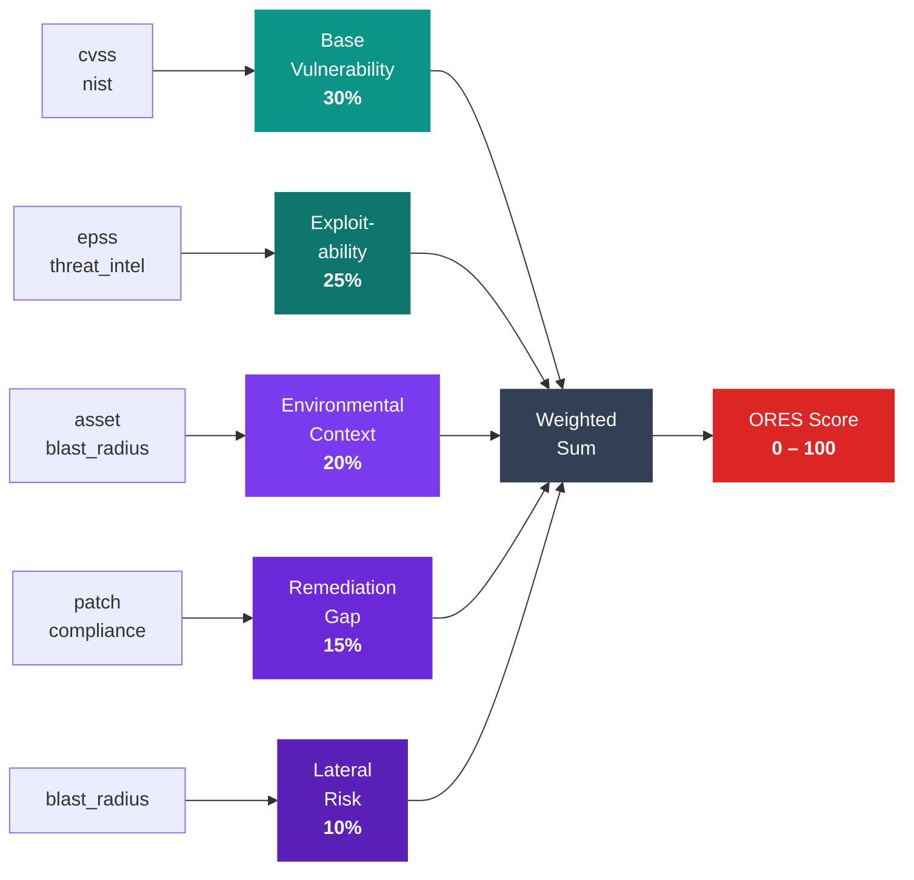

# Scoring Model

ORES produces a single **integer score from 0 to 100** that represents the prioritized risk of a vulnerability in your specific environment. This page explains how that score is built, what each component means, and how to interpret the factor breakdown returned in every result.

---

## How Scoring Works

The scoring pipeline decomposes risk into **five independent dimensions**, computes each one from its contributing [signals](signals.md), then combines them using a weighted sum:



---

## Score Range and Labels

Every score maps to a severity label. Use these labels to drive prioritization, SLAs, and automated workflows:

| Score | Label | Badge | Interpretation |
|:-----:|:-----:|:-----:|----------------|
| 90 - 100 | `critical` | <span class="ores-score ores-score--critical">Critical</span> | Immediate action required. High-confidence exploit path with significant impact. |
| 70 - 89 | `high` | <span class="ores-score ores-score--high">High</span> | Prioritize within the current sprint. Significant risk with credible exploit activity. |
| 40 - 69 | `medium` | <span class="ores-score ores-score--medium">Medium</span> | Plan remediation. Real risk but lower likelihood or environmental impact. |
| 10 - 39 | `low` | <span class="ores-score ores-score--low">Low</span> | Monitor. Vulnerability exists but contextual factors reduce effective risk. |
| 0 - 9 | `info` | <span class="ores-score ores-score--info">Info</span> | Informational. Risk is negligible given the available signals. |

---

## The Five Dimensions

### :material-shield-bug-outline: 1. Base Vulnerability — 30%

**What it captures:** The intrinsic severity of the vulnerability itself, independent of your environment.

**Signals:** `cvss`, `nist`

The base vulnerability dimension reflects how severe a flaw is according to established scoring standards. A remotely exploitable, authentication-free, complete-system-compromise vulnerability scores at the top. A locally-exploitable, low-impact issue with complex attack requirements scores at the bottom.

When you provide a CVSS base score, it is the primary driver. The NIST severity label serves as a supplementary source — useful when only a qualitative classification is available, or to cross-validate a CVSS score.

---

### :material-target: 2. Exploitability — 25%

**What it captures:** The probability and confirmed activity of real-world exploitation.

**Signals:** `epss`, `threat_intel`

This dimension answers: *"Is this vulnerability actually being exploited?"* A theoretical vulnerability with no public PoC scores low here, regardless of its CVSS base score. A vulnerability with high EPSS probability and a confirmed CISA KEV entry scores at the top.

EPSS probability is the primary continuous driver. Confirmed active exploitation and ransomware association act as strong binary amplifiers.

---

### :material-server-security: 3. Environmental Context — 20%

**What it captures:** The risk contributed by **your specific environment** — who is exposed and what they protect.

**Signals:** `asset`, `blast_radius`

Two vulnerabilities with identical CVSS scores can have very different effective risk depending on where they live. A critical CVE on an air-gapped internal tool poses far less risk than the same CVE on a public-facing crown-jewel system that processes PII.

This dimension scales risk by asset criticality, network exposure, data sensitivity, and scope of potential impact.

---

### :material-wrench-clock: 4. Remediation Gap — 15%

**What it captures:** How far behind your remediation posture is relative to available mitigations.

**Signals:** `patch`, `compliance`

A vulnerability with a patch sitting undeployed for 90 days poses substantially more risk than one where no patch is yet available. Patch staleness is the primary driver. Compensating controls reduce this dimension's contribution. Compliance scope and regulatory impact add to it — a vulnerability on a PCI-DSS in-scope system with no patch strategy carries regulatory consequence beyond the technical risk.

---

### :material-expansion-card: 5. Lateral Risk — 10%

**What it captures:** The potential for a successful exploit to **spread beyond the initial target**.

**Signals:** `blast_radius`

Even a low-criticality host can serve as a pivot point into high-value systems. This dimension captures the amplification effect of lateral movement potential and the breadth of systems that could be affected.

---

## Weight Distribution

The five dimensions do not contribute equally. The weight distribution reflects empirical research on what factors most reliably predict real-world security incidents:

| Dimension | Weight | Visual |
|-----------|:------:|--------|
| :material-shield-bug-outline: Base Vulnerability | **30%** | ████████████████████████████░░ |
| :material-target: Exploitability | **25%** | ████████████████████████░░░░░░ |
| :material-server-security: Environmental Context | **20%** | ███████████████████░░░░░░░░░░ |
| :material-wrench-clock: Remediation Gap | **15%** | ██████████████░░░░░░░░░░░░░░░ |
| :material-expansion-card: Lateral Risk | **10%** | █████████░░░░░░░░░░░░░░░░░░░░ |
| | **100%** | |

!!! note "Weights may change between model versions"
    The scoring formulas are defined in source code and may change between model versions. Do not hard-code dependencies on specific weight values. Any change will be documented in the [CHANGELOG](https://github.com/rigsecurity/ores/blob/main/CHANGELOG.md) with a model version bump.

---

## Factor Decomposition

Every `EvaluationResult` includes an `explanation.factors` array that shows exactly how your score was built. Each factor entry contains:

`factor`
:   The dimension name

`contribution`
:   The integer points this dimension contributed to the total score

`derived_from`
:   Which signal types provided the input for this dimension

`reasoning`
:   A plain-language description of the dimension's raw score level

The contributions across all five factors **sum exactly to the total score**. ORES uses the [largest-remainder method](https://en.wikipedia.org/wiki/Largest_remainder_method) to distribute integer contributions without rounding drift.

### Example: Score of 87

Here is the factor breakdown for a vulnerability scored at <span class="ores-score ores-score--high">87 High</span>:

```json
"factors": [
  {
    "name": "base_vulnerability",
    "contribution": 26,
    "derived_from": ["cvss"],
    "reasoning": "Base severity score from vulnerability data (high impact: 88%)"
  },
  {
    "name": "exploitability",
    "contribution": 22,
    "derived_from": ["epss", "threat_intel"],
    "reasoning": "Likelihood of exploitation based on threat landscape (high impact: 93%)"
  },
  {
    "name": "environmental_context",
    "contribution": 17,
    "derived_from": ["asset"],
    "reasoning": "Environmental risk based on asset criticality and exposure (high impact: 74%)"
  },
  {
    "name": "remediation_gap",
    "contribution": 13,
    "derived_from": ["patch"],
    "reasoning": "Remediation posture based on patch availability and compliance (moderate impact: 58%)"
  },
  {
    "name": "lateral_risk",
    "contribution": 9,
    "derived_from": ["defaults"],
    "reasoning": "Lateral movement potential based on blast radius (moderate impact: 30%)"
  }
]
```

Reading this breakdown:

- **26 + 22 + 17 + 13 + 9 = 87** — contributions sum to the total
- `base_vulnerability` and `exploitability` are the dominant drivers (48 of 87 points)
- `lateral_risk` shows `"derived_from": ["defaults"]` — no `blast_radius` signal was provided, so the engine used neutral defaults

!!! tip "Derived from defaults = opportunity to improve"
    Any factor showing `"derived_from": ["defaults"]` indicates a dimension backed by assumptions rather than real data. Providing the corresponding signal will improve both accuracy and [confidence](confidence.md).

---

## Determinism Guarantee

!!! info "Pure function — identical inputs always produce identical outputs"
    ORES scoring is **fully deterministic**. There is no randomness, no clock dependency, and no external data fetching. Given the same input, you will always get the same score.

This is guaranteed by four design decisions:

1. **Sorted signal processing** — Signals are sorted alphabetically by name before processing, eliminating Go's non-deterministic map iteration order.

2. **No timestamps or randomness** — The engine has no clock reads, random state, or external data fetches. It is a pure function of its inputs.

3. **Stable integer rounding** — The largest-remainder method is deterministic for a given set of dimension scores, eliminating floating-point rounding ambiguity.

4. **Versioned model** — The scoring model is versioned (`model.version` in every result). A given model version will always score a given input the same way, even across ORES upgrades.

This makes ORES suitable for:

- **Audit logs** — scores are reproducible and verifiable
- **Diff-based alerting** — "the score changed from 72 to 91" is meaningful
- **Compliance workflows** — score reproducibility satisfies regulatory requirements
- **CI/CD gates** — deterministic scores mean deterministic pipeline decisions
